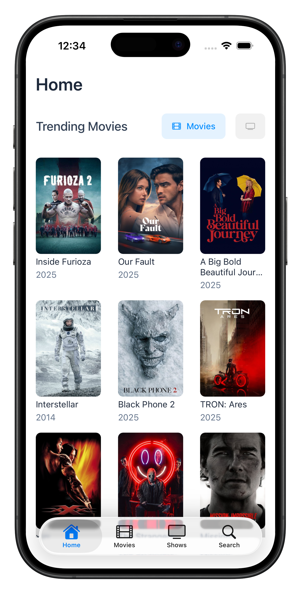

# MediaTracker

Track movies and TV shows you want to watch. Search, save, pin, mark as watched, and view details like cast, seasons, and where to watch.

## Overview

Media Tracker is a React Native app built with Expo and expo-router. It integrates with the TMDB API for data and uses a local SQLite database to make your library fast and accessible offline. It’s a clean, minimal media tracker optimized to run on iOS and Android.

- Search across movies and TV shows
- Browse trending content
- View details (e.g., overview, year, runtime, genres, cast, seasons)
- See watch providers (stream, buy, rent) (Region set to Sweden)
- Save items to your library, pin items you plan to watch next or are currently watching, and mark them as watched
- Toggle between active watchlist and watched items for a full catalog of your watch history

## Key Features

- Search movies and TV shows with optional filters (narrow down the search to Movies or Shows)
- Home page shows trending lists for quick discovery; filter between trending shows or movies
- Detail screen with:
  - Poster, title, year, runtime, rating, genres
  - Overview
  - Seasons list (for Shows)
  - Cast list
  - Watch providers (SE region)
- Library management:
  - Save/remove items
  - Pin up to 3 items per media type
  - Toggle watched status (watched items are auto-unpinned)
- UX:
  - Loading states via context
  - Haptic feedback on button presses and on success or error

## Screenshots:

<p align="center">
  
  
  
</p>

<p align="center">
  
  
  
</p>

## Tech Stack

- React Native 0.81 + Expo 54
- expo-router for file-based navigation
- Expo Native Tabs
- SQLite persistence via expo-sqlite
- TMDB API for media data

## Quick Start

Prerequisites:

- Node.js LTS
- iOS Simulator / Android Emulator, or the Expo Go app

1. Install dependencies:

```bash
npm install
```

2. Configure environment (see “## Configuration”)

3. Start the app (interactive dev server):

```bash
npm start
# or
npx expo start
```

4. Run on a device:

```bash
# iOS Simulator
npm run ios

# Android Emulator
npm run android

# Web
npm run web
```

## Configuration

This app uses the TMDB API. You must provide a bearer token via environment variables.

Environment variables used:

- `EXPO_PUBLIC_TMDB_TOKEN` — TMDB Read Access Token (v4 auth, Bearer)
- Example can be viewed in the `.env.example` file

Example `.env` (create at the repo root):

```
EXPO_PUBLIC_TMDB_TOKEN=<YOUR_TMDB_BEARER_TOKEN>
```

Notes:

- The watch providers region is currently set to “SE” (Sweden). To change it, edit `getProviders` in `app/api/tmdb.js`.

## Usage

- Search:
  - Enter a query; optionally toggle “Movies” or “Shows”; then submit.
- Save to library:
  - On the Details screen, tap “Save to Library.” Toggling pinned or watched will auto-save if needed.
- Pinning:
  - Tap the bookmark icon at the top of the details screen. You can pin up to 3 items per media type.
- Mark watched:
  - Tap “Toggle Watched.” Watched items are automatically unpinned.
- Library:
  - Switch between watchlist and watched by tapping the buttons above saved items.

## License

For educational purposes only.

## Contact

Created by Jacob Asker  
Email: jacob.asker@icloud.com

---
